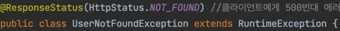

# RestAPI

## ExceptionHandling Part1.
#### ASIS: "/users/100" 즉, 없는 100번 유저 조회 시 '200OK'와 함께 정상 조회

#### TOBE: 없는 유저 조회 시 , 에러 코드와 함께 "없는 유저입니다." 라는 메시지 출력 필요.

#### PROBLEM: 에러 발생메시지를 그대로 출력하여 예외발생의 원인이 되는 부분을 그대로 노출하기 때문에 보안상의 허점 노출.
####        따라서, 이를 가공하여 Client에 보낼 필요가 있다.

## ExceptionHandling Part2.
#### ASIS: 예외발생의 원인이 되는 부분 그대로 노출.
#### TOBE: 다른 적절한 상태로 프로그램을 개선.
##### -> 사용자가 없는것은 리소스가 존재하지 않는 것이기 때문에 404 NOT FOUND 반환 예정.

