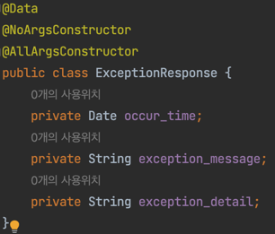
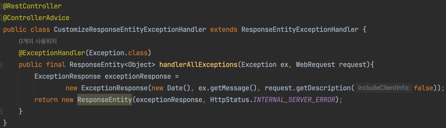
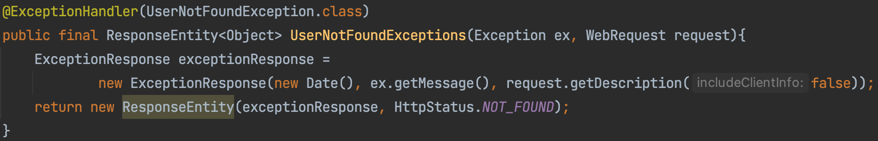
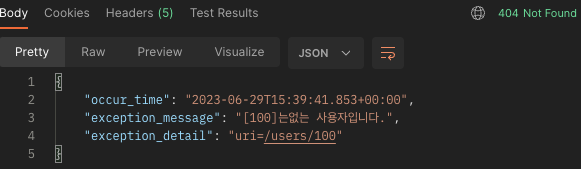

# RestAPI
## AOP ExceptionHandling Part1.
#### AOP(Aspect-Oriented Programming): 핵심로직과 부가기능을 분리하여 애플리케이션 전체에 걸쳐 사용되는 부가기능을 모듈화하여 재사용할 수 있도록 함. (+AOP에 대해 추후 보완 예정)
### ExceptionHandling에서 작성한 내용을 AOP를 적용해보자.
#### 1. 예외메시지를 반환할 "ExceptionResponse.java"를 만들자.

#### 2. "ResponseEntityExceptionHandler"를 상속하는 "CustomizeResponseEntityExceptionHandler.java"를 만들자
##### Why extends ResponseEntityExceptionHandler? : HTTP Request에 관련된 예외를 처리할 수 있는 메소드

##### @RestController : "@Controller+@ResponseBody"로, 문자열과 JSON, XML 등을 전송가능.
###### @Controller와의 차이점은? @Controller는 Model객체를 만들어 데이터를 담고 View를 찾아 반환. @RestController는 모든 메소드가 객체로 작성되고 반환됨.
##### @ControllerAdvice: @ControllerAdvice는 @Controller가 있는 모든 곳에서 예외를 잡아, @ExceptionHandler에서 예외를 처리함.
###### 1. @ExceptionHandler, @ModelAttribute, @InitBinder가 적용된 메서들에 대해 AOP를 적용
###### 2. 모든 @Controller에 대해 전역적으로 발생할 수 있는 예외를 잡아줌 → 속성 설정을 통해 원하는 Controller나 Package 선택 가능.
###### 3. @Component가 선언되어 있어 Bean으로 관리됨.
##### @ExceptionHandler: @Controller가 적용된 Bean에서 발생하는 예외를 잡아 하나의 메서드에서 처리하는 기능 수행.
## AOP ExceptionHandling Part2.
### ASIS: 모든 예외들을 처리함 -> TOBE: 사용자가 존재하지 않았을때, 그에 맞는 예외메시지를 출력하기를 원함.

