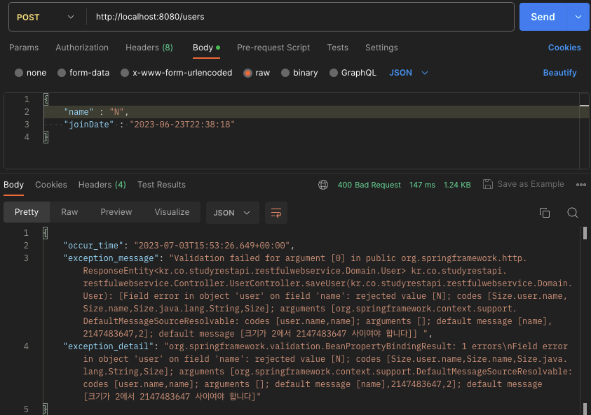

# RestAPI
## Status Code 제어
#### Status Code 200은 서버가 정상적으로 처리했다는 의미. 하지만, GET Method와 POST Method는 용도가 다르기 때문에, 가능하면 Status Code도 구분해서 사용하면 좋음
 
 
#### + 각 메소드에 맞는 상태코드 반환과 더불어, POST Method로 추가 시 어떤 리소스가 추가되었는지 알 수 있게 Header에 추가해서 반환 예정
 
### 서버로부터 요청 결과값에 적절한 상태코드를 반환하는 것이 좋은 Rest API 설계방법!!!

## ExceptionHandling Part1.
#### ASIS: "/users/100" 즉, 없는 100번 유저 조회 시 '200OK'와 함께 정상 조회

#### TOBE: 없는 유저 조회 시 , 에러 코드와 함께 "없는 유저입니다." 라는 메시지 출력 필요.

#### PROBLEM: 에러 발생메시지를 그대로 출력하여 예외발생의 원인이 되는 부분을 그대로 노출하기 때문에 보안상의 허점 노출.
####        따라서, 이를 가공하여 Client에 보낼 필요가 있다.

## ExceptionHandling Part2.
#### ASIS: 예외발생의 원인이 되는 부분 그대로 노출.
#### TOBE: 다른 적절한 상태로 프로그램을 개선.
##### -> 사용자가 없는것은 리소스가 존재하지 않는 것이기 때문에 404 NOT FOUND 반환 예정.

