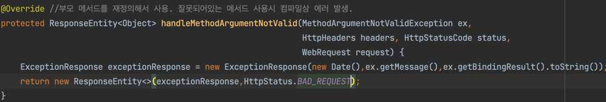

# RestAPI
## 사용자의 INPUT 값에 대한 ValidationCheck
#### JDK에 포함된 ValidationAPI와 hibernate library에 포함된 hibernate Validation을 사용하여 JAVA POJO객체에 저장된 데이터의 상태값에 대해 유효성 검사

#### @Size(min=2)로, 2글자 이상이 아니기 때문에 Validation Error 발생

#### 해당 에러를 처리하기 위해 부모클래스(ResponseEntityExceptionHandler)의 함수를 재정의
#### @Override: 부모클래스의 메서드를 재정의하기 위해 사용. 

#### @Size(min=2, message=""") 지정으로 ValidationCheck간 에러 발생 시 원하는 에러메시지 출력 가능.